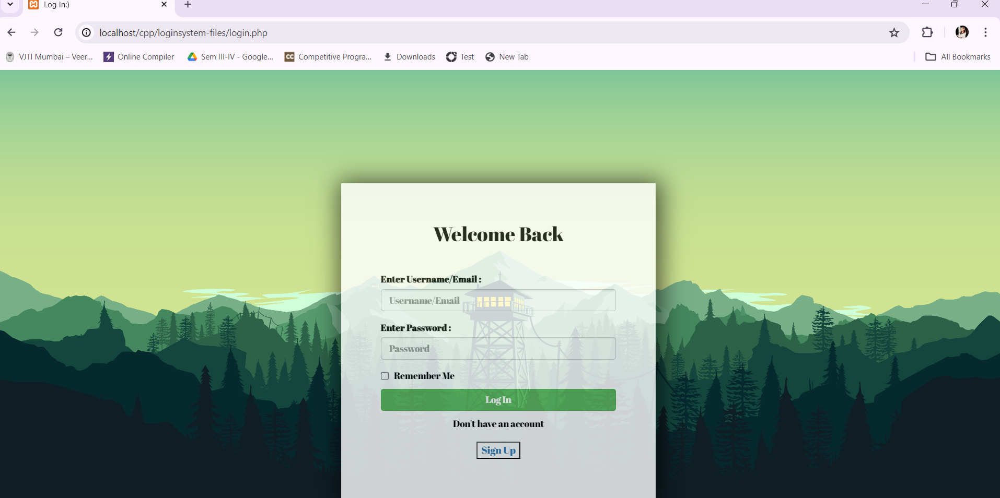
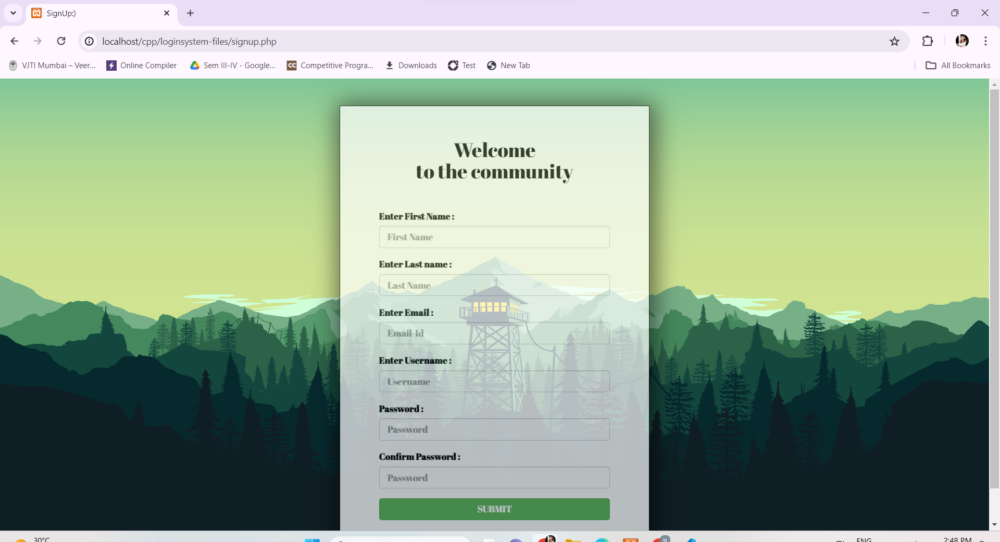
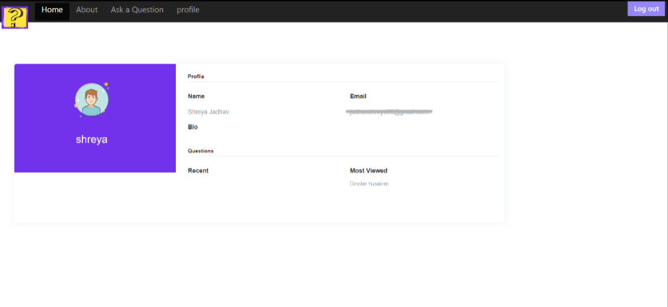
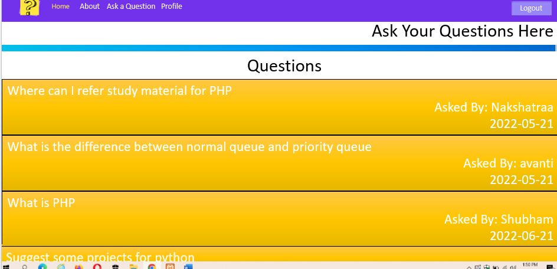

# Starmind

Starmind is an online platform designed to facilitate question and answer interactions primarily aimed at students. It serves as a knowledge-sharing platform where users can ask questions, seek answers, and engage in discussions on various topics related to education and learning. The platform aims to bridge the gap between students and educators, providing a space for collaborative learning and knowledge exchange. Through features such as personalized user accounts, categorized questions, and user ratings, Starmind aims to create an interactive and user-friendly environment for knowledge seekers and contributors.

## Prerequisites:

- Install XAMPP on your computer.
- Install Git on your computer.

## Downloading the Project:

1. Open terminal.
2. Navigate to XAMPP's htdocs directory.
3. Clone the repository from GitHub: `git clone https://github.com/nakshatraa/Starmind.git`.
4. Navigate to the project directory: `cd Starmind`.

## Setting Up and Running the Project:

1. Start Apache server in XAMPP.
2. Open phpMyAdmin in your browser (http://localhost/phpmyadmin).
3. Create a new database (e.g., `starmind_db`).
4. Import `database.sql` into the new database.
5. Update database credentials in `config.php`.

## Viewing the Project in Web Browser:

1. Go to http://localhost/Starmind/loginhome.php in your browser.
2. You should see the login home page of your project.
## Screenshots

### Home Page

### LogIn Page

### Sign Up Page

### About Us Page

!(Readme-screenshots/aboutus(2).png)

### Profile Page

### Questions Page

### Answers

